# Classroom50: Student Lab Guide

This guide walks you through the complete first-time Classroom50 workflow: signing in, joining the course organization, accepting an assignment, working with the repository, and submitting the assignment using a Git tag.

---

## Important Rules (Read First)

- You must **accept the assignment via the Classroom50 link** provided in [`exercises.md`](../exercises.md).
- **Do NOT fork** the assignment repository manually from `Web-Engineering-KFUPM` or anywhere else.

After acceptance, **your individual repository** will be created automatically. That Classroom50 repository is the **only valid repository** for submission.

---

## Before You Start

1. Use the GitHub account that you will use for the course (the account registered with your **KFUPM email**).
2. Make sure Git is installed on your computer.
3. Keep your GitHub username and university email available.

**Note:** Screens may look slightly different depending on your browser, operating system, or GitHub updates. Follow the same buttons and options shown in the figures.

---

## Part A — Join Classroom50 and the Course Organization

### Step 1 — Open the Classroom50 invitation

Open the Classroom50 link provided by your instructor in [`exercises.md`](../exercises.md). On the Classroom sign-in page, choose **Sign in with GitHub**.

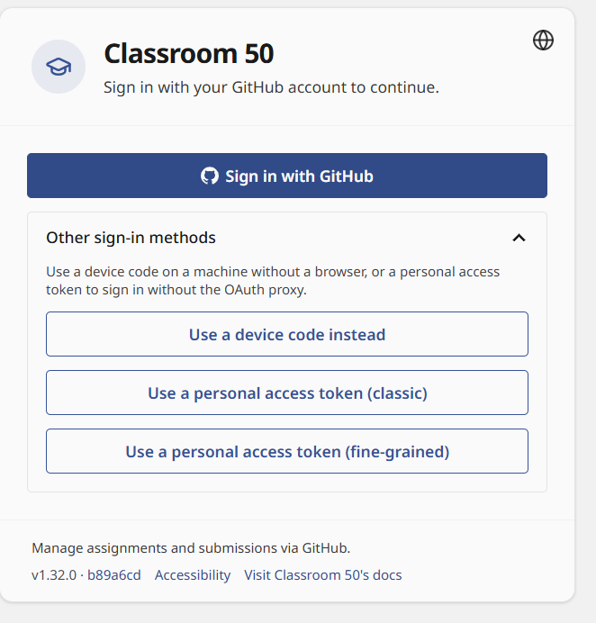

### Step 2 — Sign in to GitHub

Enter your GitHub username/email and password, then select **Sign in**.

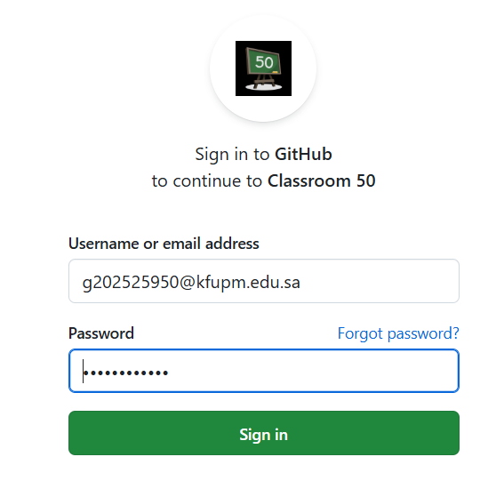

### Step 3 — Complete device verification

GitHub may send a verification code to your email. Enter the code and select **Verify**.

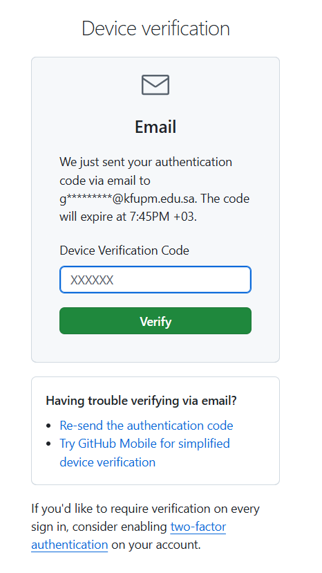

### Step 4 — Authorize Classroom50

Review the requested permissions and select **Authorize Classroom50**. This allows Classroom50 to create and manage course repositories for you.

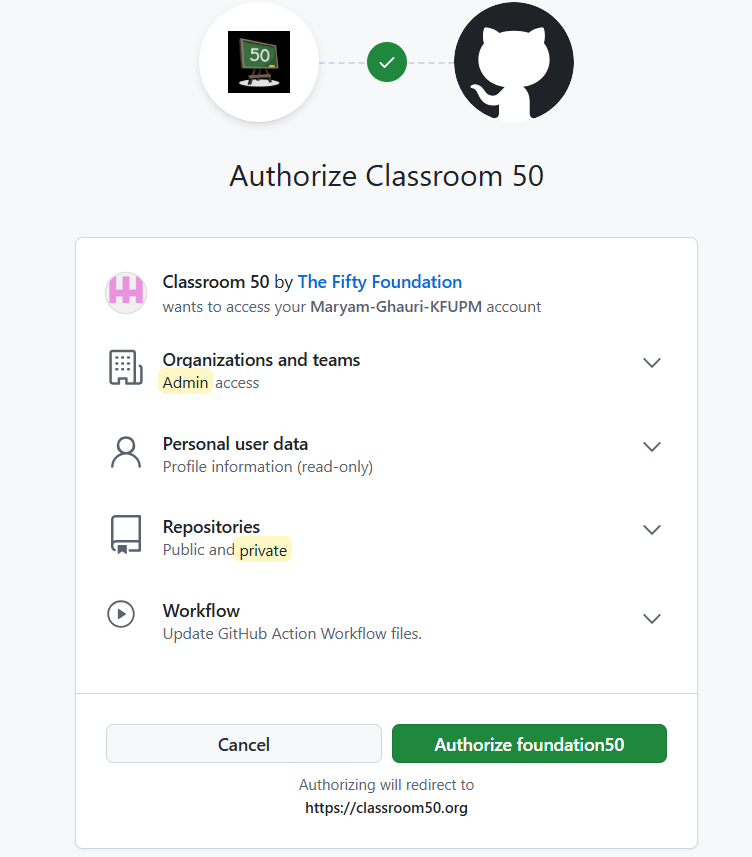

### Step 5 — Check the organization page

After authorization, Classroom50 may show the course organization. If the organization is not yet connected, follow the invitation provided by the instructor.

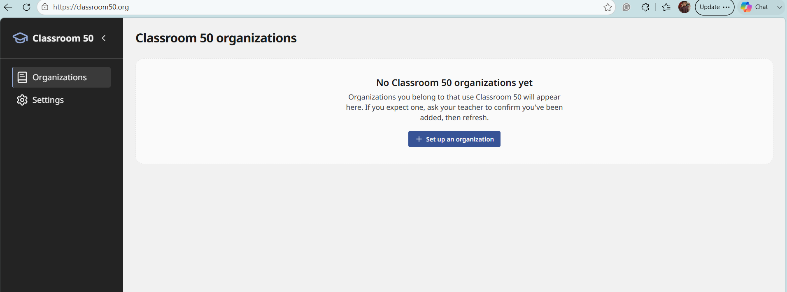

### Step 6 — Accept the organization invitation

Open the invitation email for the **Web-Engineering-KFUPM** organization and select **Join / Accept invitation**.

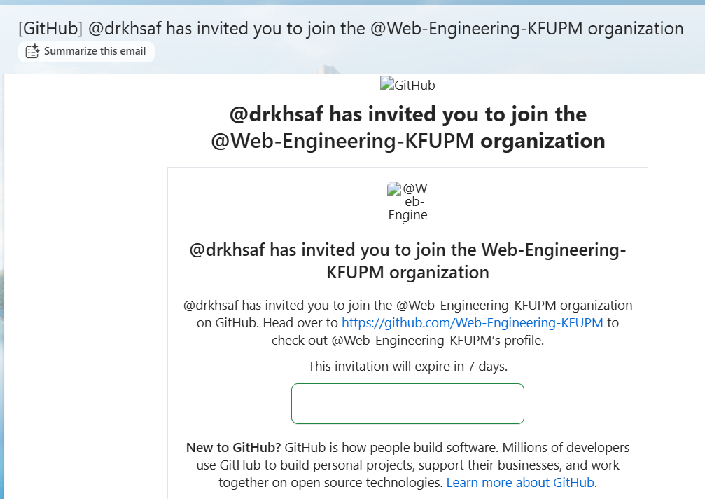

### Step 7 — Confirm the Web Engineering KFUPM page

After accepting, GitHub should show the **Web Engineering KFUPM** organization in your account.

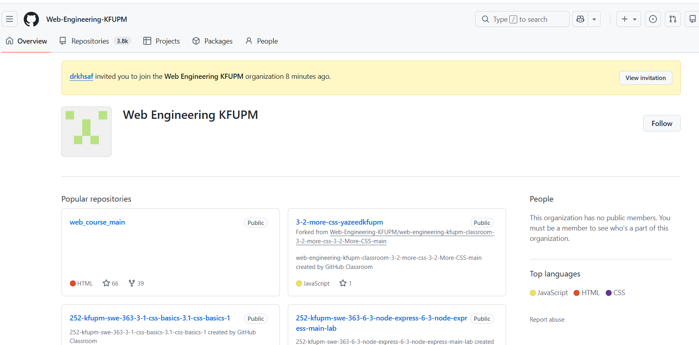

### Step 8 — Optional membership notification

You may receive a GitHub notification confirming that you were added to the Web Engineering KFUPM team/classroom.

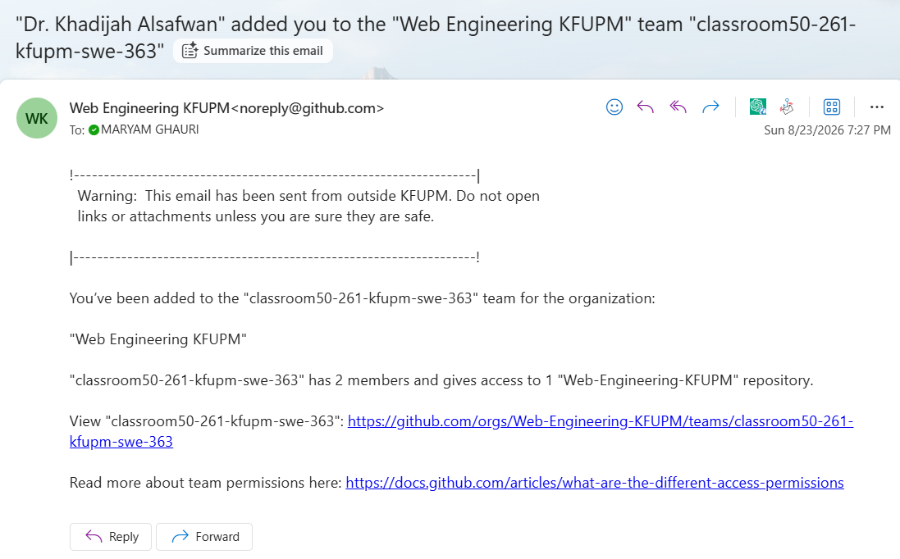

### Step 9 — Recheck Classroom50 organizations

Return to **Classroom50 → Organizations**. The course organization should now appear.

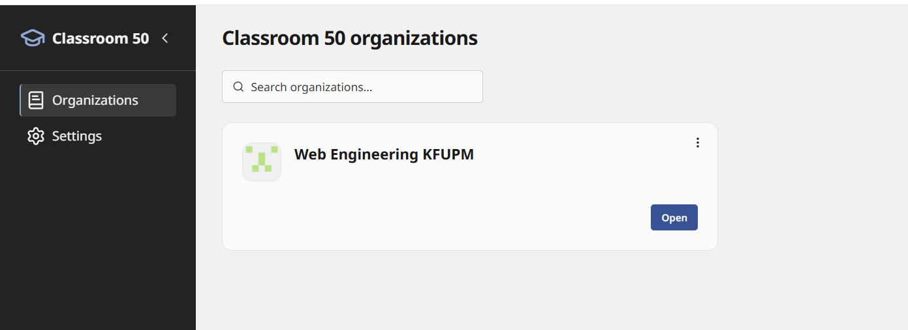

### Step 10 — Open the course organization

Select **Open** beside **Web Engineering KFUPM** to continue to the classroom.


---

## Part B — Accept and Start Your First Assignment

### Step 11 — Open Assignments

In Classroom50, open the **Assignments** area and select the assignment provided by your instructor. You can also start from the invitation link in [`exercises.md`](../exercises.md).

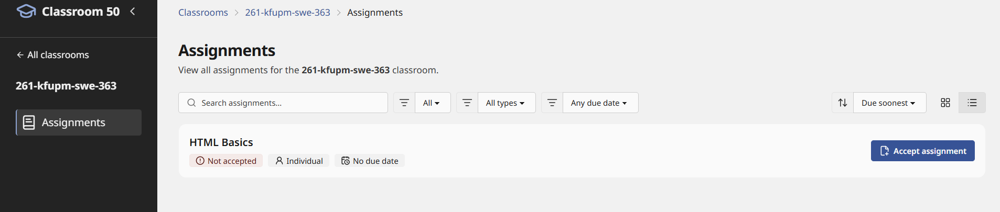

### Step 12 — Accept the assignment

Read the assignment information and select **Accept assignment**. Classroom50 will create a personal repository for your work.

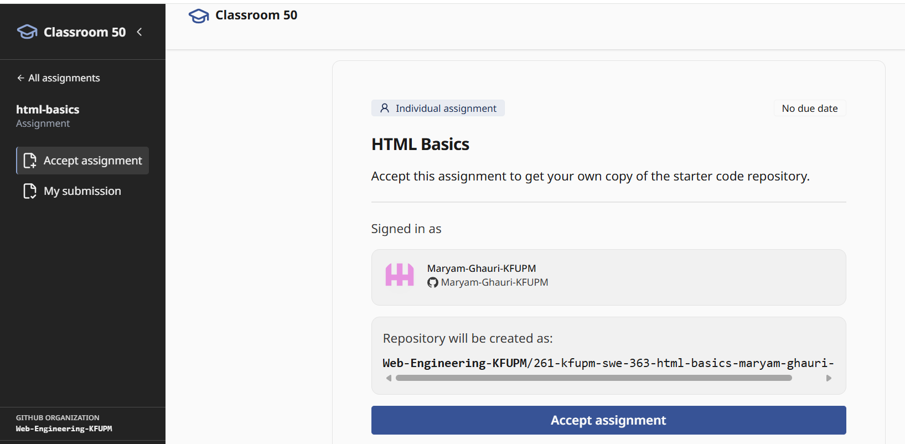

> **Note:** Repository creation can take time. Do not repeatedly click **Accept assignment**.

### Repository naming format after accepting

```
<assignment-name>-<your_github_username>
```

**Example:**

```
2-1-html-basics-jawwad183
```

This is the **only valid repository** for submission.

### Step 13 — Open your repository

When the assignment is ready, select **Open repository**. You can also use **Go to my classroom** to return to the assignment dashboard.

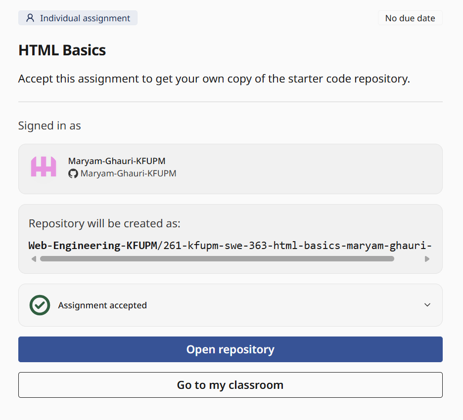

### Step 14 — Files in the repository

Your personal repository contains the starter files supplied by the instructor.

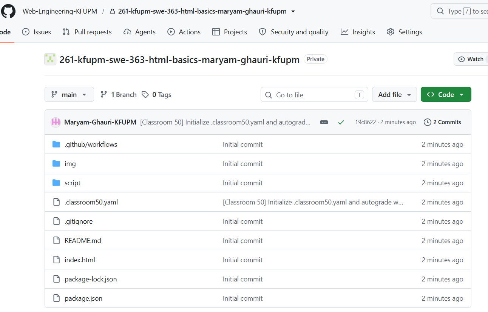

### Step 15 — Editing on GitHub

You may open a file (for example `index.html`) and edit it in the GitHub code editor. After editing, click **Commit changes**.

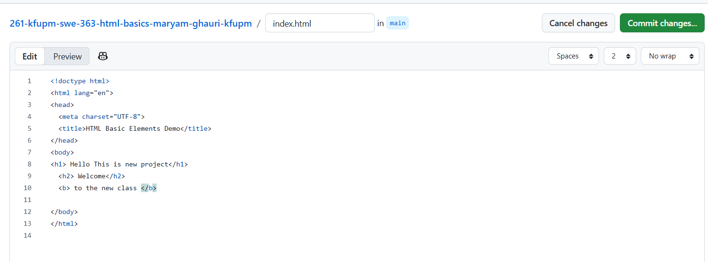

Local work in a code editor is the recommended workflow for labs. If you do commit on github.com, pull those remote changes before continuing on your computer (see Step 24).

### Step 16 — Check My submission

The **My submission** page shows whether a tagged submission has been received. Before submitting, it may show **0 tagged submissions / Not submitted yet**.

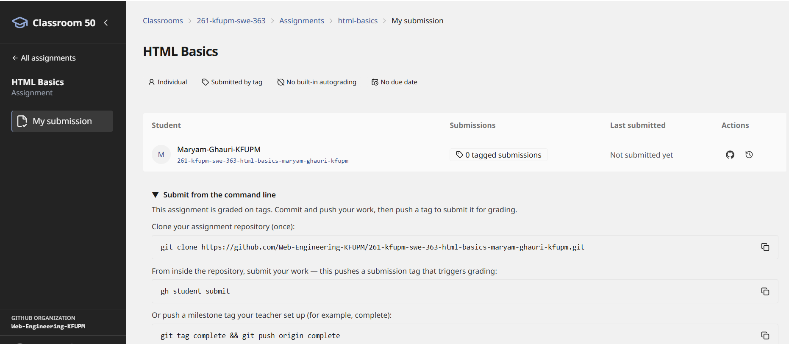

---

## Part C — Work Locally from the Command Line

Assignments are submitted using the command line. Open a terminal (Command Prompt, PowerShell, or Terminal) and clone your assignment repository.

### Step 17 — Copy the clone command

On the assignment page, copy the repository clone command. It will look similar to the following:

```bash
git clone https://github.com/<organization>/<your-assignment-repository>.git
```

For this course, the URL is typically:

```bash
git clone https://github.com/Web-Engineering-KFUPM/[ASSIGNMENT-NAME]-[YOUR-USERNAME].git
```

### Step 18 — Clone the repository

Open a terminal and run the clone command. If GitHub asks you to authenticate, complete the sign-in process.

```bash
git clone https://github.com/Web-Engineering-KFUPM/[ASSIGNMENT-NAME]-[YOUR-USERNAME].git
cd [ASSIGNMENT-NAME]-[YOUR-USERNAME]
```

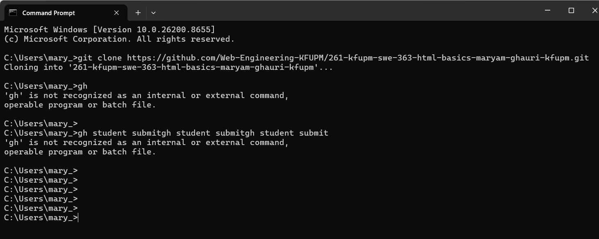

If cloning appears stuck, press `Ctrl+C`. That usually means the terminal is not signed in to GitHub. Test access first:

```bash
git ls-remote https://github.com/Web-Engineering-KFUPM/<your-assignment-repository>.git
```

### Step 19 — Sign in through Git Credential Manager

If the **Connect to GitHub** window appears, choose **Sign in with your browser**.

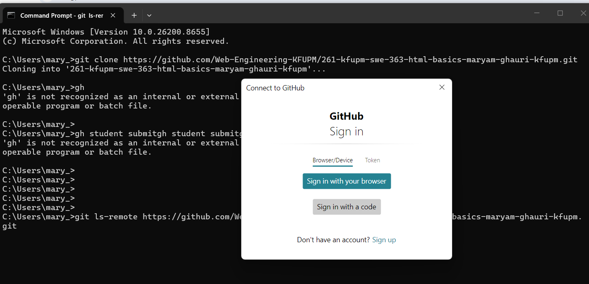

### Step 20 — Authorize Git Credential Manager

In the browser, review the permissions and authorize **Git Credential Manager** for your GitHub account.

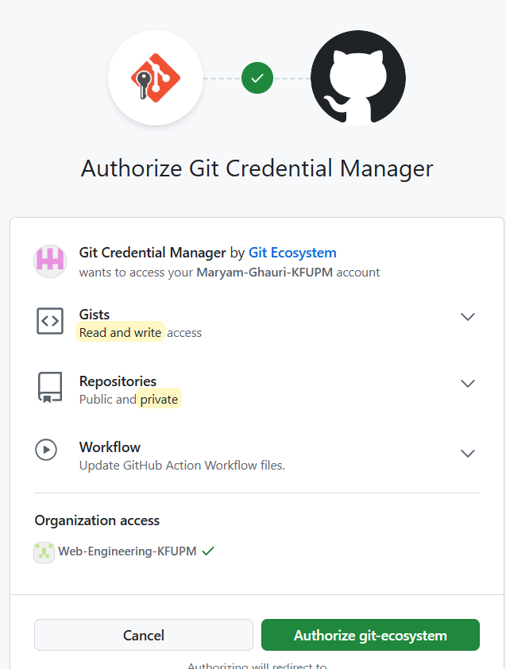

### Step 21 — Return to the terminal

After **Authentication Succeeded** appears, close the browser page and return to the terminal.

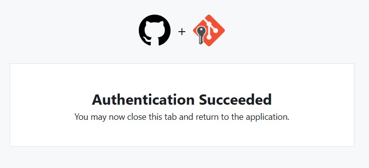

### Step 22 — If an interrupted clone left an empty folder

A failed clone can leave an empty folder. Enter the folder, list its contents, and run `git status` to check whether it is a repository. If it is empty and Git reports `not a git repository`, return to the parent folder, remove the empty folder, and clone again.

```bash
cd <repository-folder>
dir          # use `ls` on macOS/Linux
git status
cd ..
rmdir <repository-folder>   # use `rm -r <repository-folder>` on macOS/Linux
git clone <repository-url>
```

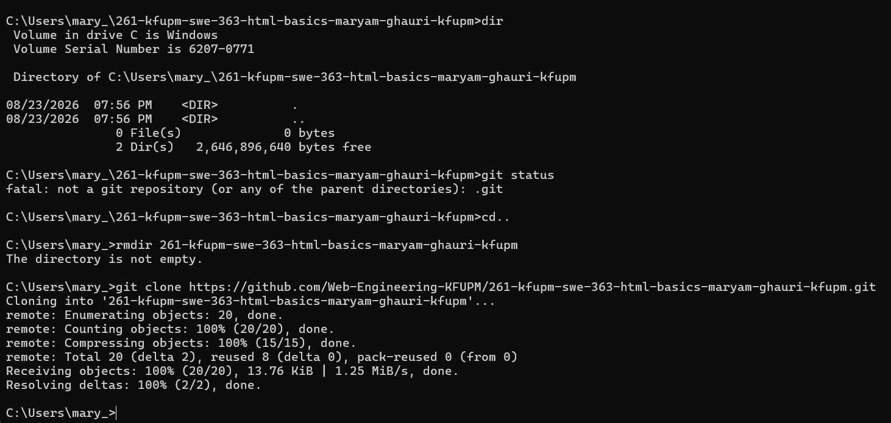

### Step 23 — Verify the local repository

After a successful clone, enter the repository and run `git status`. A clean repository normally reports that branch `main` is up to date with `origin/main`.

```bash
cd <repository-folder>
git status
```

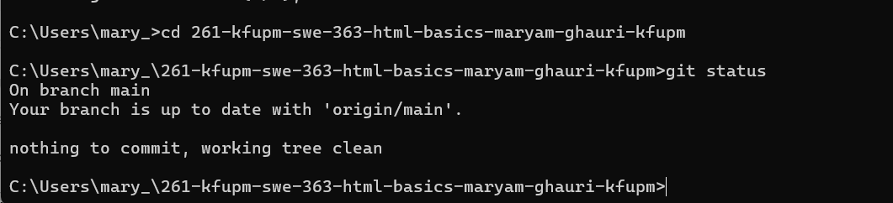

---

## Before Each Lab Session

1. **Clone your assignment repository** (only once), using the steps above.
2. **Pull the latest updates** (if any):

```bash
git pull origin main
```

---

## During Lab Sessions (How to Submit Your Work)

1. **Complete all assigned tasks and TODOs** in your local repository.
2. **Add and commit your changes** for each TODO using clear, descriptive messages:

```bash
git add .
git commit -m "Complete lab exercise: [brief description]"
```

3. **Push your changes** to your Classroom50 repository:

```bash
git push origin main
```

This push saves your work on GitHub. Official grading still requires the submission tag in Part D.

---

## Part D — Submit the Assignment for Grading

Changes committed directly on github.com are remote changes. Your local computer will not receive them automatically. Pull them before continuing local work.

### Step 24 — Pull remote changes

From inside the local repository, run:

```bash
git pull origin main
```

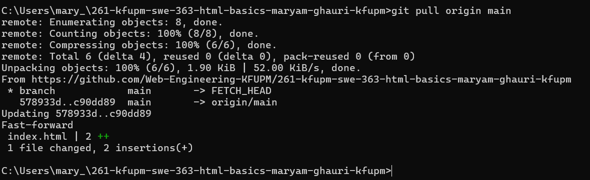

After the pull, `git status` should report that the local branch is up to date and the working tree is clean.

### Step 25 — Submit the assignment for grading

This classroom is configured for submission by **Git tag**. Finish your work, commit it, and push the `main` branch before creating the submission tag.

> **Note:** Only create the submission tag when you intend to submit the current version for grading. Follow the exact tag name specified by your instructor. The examples below use `complete`.

### Step 26 — Create the submission tag

Create the milestone/submission tag on the current commit:

```bash
git tag complete
```

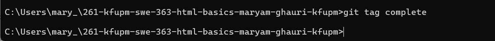

### Step 27 — Push the tag to GitHub

A local tag does not submit anything until it is pushed. Push the tag:

```bash
git push origin complete
```

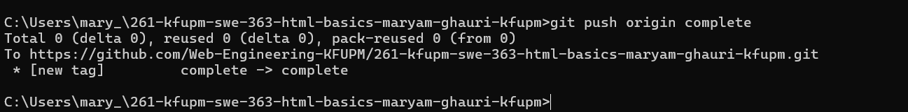

### Step 28 — Verify the submission

Refresh **Classroom50 → My submission**. The page should show a tagged submission instead of **0 tagged submissions**.

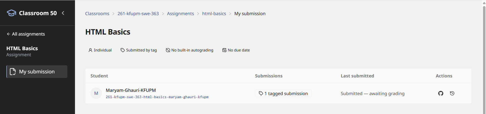

---

## Submission Notes

- **Timing:** Must be pushed **before the due date**. Late submissions are not allowed.
- **Content:** All required files and **all TODOs must be completed**.
- **Quality:** Code must be functional and properly formatted.
- **Documentation:** Add comments where appropriate.
- **Commit messages:** Use descriptive and professional messages.

**Full marks** are awarded only if all conditions above are met.

---

## Mistakes Students Commonly Make

Forking the assignment repository manually.

Accepting the assignment correctly but:

- Pushing to your **personal GitHub repository**
- Pushing to a **forked repository**
- Pushing to **any repository not created by Classroom50**

**Only the Classroom50 repository will be graded.**

---

## Troubleshooting

### Problem: `git clone` appears stuck

If cloning shows only `Cloning into ...` for a long time, Git may be waiting for authentication. Cancel with `Ctrl+C` if necessary, then test repository access:

```bash
git ls-remote <repository-url>
```

Complete the GitHub browser authentication prompt if it appears, then retry the clone.

The following screenshot shows a clone that has started but is waiting. If this happens, complete GitHub authentication rather than waiting indefinitely.

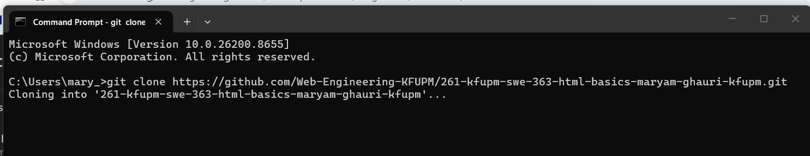

### Problem: `fatal: repository '...' not found` (shared / lab PC)

If the URL is correct and the repository exists, but cloning returns:

```bash
Cloning into 'my-repo'...
fatal: repository 'https://github.com/owner/repo.git/' not found
```

this usually means Git is authenticating as the **wrong account**. On a shared lab PC, a previous user's GitHub credential is often still cached by **Git Credential Manager**, so Git silently sends a token that does not have access to your repository. GitHub returns `not found` (not "access denied") for private repos the authenticated user cannot see.

To fix it, remove the cached GitHub credential so you are prompted to log in with your own account.

**Option A — Credential Manager (GUI):**

1. Open **Start** → **Credential Manager** → **Windows Credentials**.
2. Under **Stored user names**, find the entry `git:https://github.com`.
3. Select it and choose **Remove**. Delete every GitHub entry if more than one exists.

**Option B — Command line:**

```bat
cmdkey /list
cmdkey /delete:git:https://github.com
```

Then verify the credential is gone and re-authenticate with your **KFUPM** account:

```bash
cmdkey /list | findstr /i "github"
git config --global user.name  "Your GitHub Name"
git config --global user.email "your_kfupm_email@example.com"
git clone https://github.com/owner/repo.git
```

Complete the GitHub browser prompt (or enter your username and a **personal access token**) using the account registered with your KFUPM email. See *Verify the correct GitHub account* below.

> **Tip:** On shared lab machines, clear your GitHub credentials before logging off so the next user does not hit this error.

### Problem: destination path already exists

This usually means an earlier clone attempt created the folder. Check the folder before deleting anything. If it is empty and is not a Git repository, remove it from the parent directory and clone again.

### Problem: `'gh' is not recognized`

The `gh` command belongs to GitHub CLI, which is separate from Git. If GitHub CLI is not installed, use the Git tag submission method provided by the assignment (for example, `git tag complete` followed by `git push origin complete`).

### Problem: `git status` says working tree clean after I edited a file

- Save the file in your local editor (`Ctrl+S` / `Cmd+S`).
- Confirm that you opened the same repository folder that the terminal is using.
- If you edited the file on github.com, the change is remote; run `git pull origin main` instead.

### Problem: `git push` fails because Git identity is not configured

```bash
git config --global user.name "Your GitHub Name"
git config --global user.email "your_kfupm_email@example.com"
```

### Verify the correct GitHub account

- Use the GitHub account registered with your **KFUPM email**.
- Sign out of all GitHub accounts, clear browser cache and cookies, then log in again.
- If needed, try Incognito/Private Mode or a different browser.

### Still having issues?

- Confirm you are using the GitHub account linked to Classroom.
- Re-authenticate GitHub on your machine.
- Contact the instructor or TA to verify Classroom account mapping.

---

## Quick Reference — Commands Students Will Use Most

| Purpose | Command |
| --- | --- |
| Check repository status | `git status` |
| Download remote changes | `git pull origin main` |
| Stage changes | `git add .` |
| Commit changes | `git commit -m "Your message"` |
| Push commits | `git push origin main` |
| Create submission tag | `git tag complete` |
| Push submission tag | `git push origin complete` |

---

## Recommended Student Workflow

1. Accept the assignment via the Classroom50 link in [`exercises.md`](../exercises.md) and open the repository.
2. Clone the repository once.
3. Open the local folder in your code editor and complete part of the lab.
4. Save files, then run `git status`.
5. Run `git add .`, commit with a meaningful message, and push to `main`.
6. Repeat commits and pushes as you continue the assignment.
7. When the assignment is complete, make a final commit and push.
8. Create and push the instructor-specified submission tag (for example `complete`).
9. Refresh **My submission** and confirm that the tagged submission is visible.

---

## Security

Do not share passwords, personal access tokens, or authentication codes with anyone. Screenshots in this guide are examples; students should use their own GitHub accounts and repository URLs.

---

## Support Resources

- Instructor office hours
- Teaching assistants office hours
- Peer collaboration during lab time
- Online documentation and tutorials
- **GitHub Starter Course:** https://github.com/Web-Engineering-KFUPM/github-starter-course

---

## Credit

This guide was created by **Maryam Ghauri**, Semester 261 Teaching Assistant.
